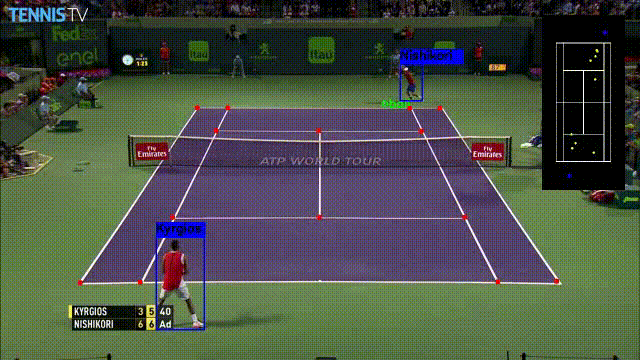
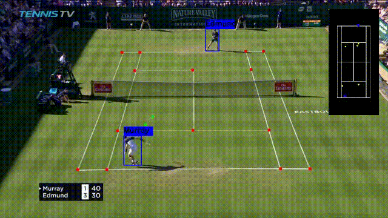
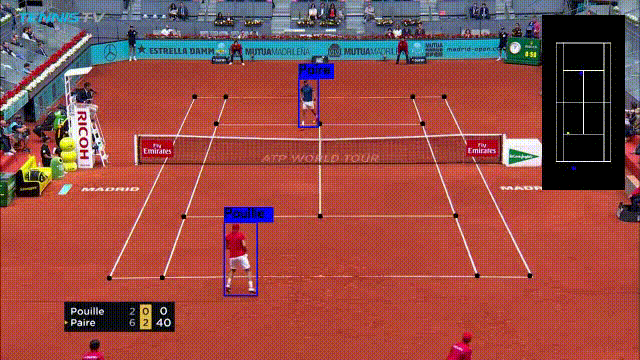
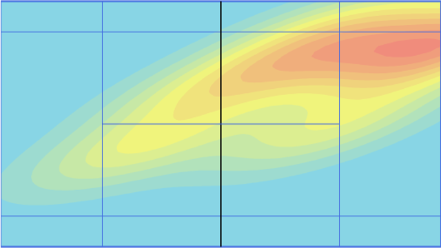

# Dashboard
Access the dashboard here:  
🔗 [scai-ai-league-production-2128.up.railway.app](https://scai-ai-league-production-2128.up.railway.app/)

**Login Credentials:**  
- **Username:** `thamer`  
- **Password:** `123qwe`

#  TennisProject

Tennis analysis using deep learning and machine learning.  

---

##  Visual Outputs

  
  
  

---

###  Player Detection
We utilized **FasterRCNN** for player detection and tracking throughout tennis matches.

###  Ball Detection
For detecting the tennis ball during gameplay, we implemented **TrackNet**, which provides accurate ball tracking even in challenging conditions. The model has been thoroughly tested on match footage and delivers reliable results.

###  Bounce Detection
To accurately identify when the ball bounces during gameplay, we implemented a **CatBoostRegressor** model. This model analyzes the ball's trajectory data from the previous detection step to predict bounce occurrences with high precision.

###  Court Detection
We developed a custom neural network model for detecting the tennis court, specifically trained to identify **14 key points** that define the court boundaries and lines. Our model was trained on a comprehensive dataset of **19,000 frames**, ensuring robust performance across various lighting conditions and camera angles.

---

##  How to Run

Prepare a video file with resolution **1280x720**

1. Clone the repository  
   `git clone https://github.com/Hodorth01/SCAI-AI-LEAGUE`

2. Change directory  
   `cd model/TennisProject`

3. Install dependencies  
   `pip install -r requirements.txt`

4. Run the main script  
   `python main.py <args>`  
   This will generate:
   - CSV file with detailed analysis data  
   - Processed video featuring a minimap of the game

5. Run the visualizer  
   `python visualizer.py <args>`  
   The visualizer provides:
   - Heat map of ball movement  
   - Ball bounce coordinates  
   - Detailed card information for each bounce
